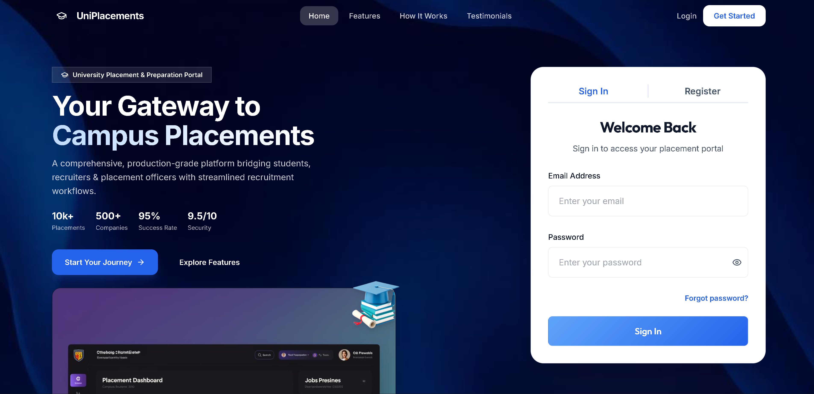

# 🎓 University Placement & Preparation Portal

[](https://opensource.org/licenses/MIT)
[](http://makeapullrequest.com)
[](https://github.com/Mohit-cmd-jpg/University-Placement-Management-System)
[](https://uniplacements.vercel.app)
[](https://uniplacements.vercel.app/api)
[](https://react.dev/)
[](https://nodejs.org/)
[](https://www.mongodb.com/)

A comprehensive full-stack platform designed to bridge the gap between students, recruiters, and placement officers. This portal streamlines the recruitment lifecycle while empowering students with AI-driven preparation tools.

---

## 🚀 Vision
PlacePrep centralizes the university placement process—moving away from scattered spreadsheets and manual tracking to a unified, digital-first workspace. It helps students prepare for their dream careers while providing recruiters with powerful tools to find the right talent.

---

## 🟢 Live Deployment

### 🌐 Production URLs
- **Main Application:** [https://uniplacements.vercel.app](https://uniplacements.vercel.app)
- **API Base URL:** [https://uniplacements.vercel.app/api](https://uniplacements.vercel.app/api)
- **GitHub Repository:** [https://github.com/Mohit-cmd-jpg/University-Placement-Management-System](https://github.com/Mohit-cmd-jpg/University-Placement-Management-System)

### Demo Credentials
Contact the project owner for demo account details to test all features including:
- Student portal with mock tests and interview prep
- Recruiter dashboard for job postings and ATS
- Admin panel for verification and analytics

💡 **Tip:** Create your own account to explore the platform in real-time.

---

## 🖼️ Project Visuals

### Frontpage



### Sign In Page


### Register Page


### Student Dashboard


### Job Listings


### Mock Test Page


### Interview Prep


### Admin Page


---

## ✨ Key Features

### For Students 🎓
- **📊 Personalized Dashboard**: Real-time tracking of applications and upcoming placement drives.
- **🔍 Smart Job Finder**: Advanced filtering and eligibility checks for job roles.
- **📄 Resume Upload + ATS Analysis**: AI-powered scoring with criteria-wise breakdown and targeted resume improvements.
- **💡 AI Preparation Hub**:
  - **Structured DSA Roadmap**: A curated 8-week guide for coding excellence.
  - **Practice Portals**: Topic-wise coding challenges and theoretical concepts.
  - **AI Mock Tests**: Timed assessments with instant feedback.
  - **AI Interview Prep + Evaluation**: Role-based questions, detailed feedback, model answers, and improvement tips.
  - **Skip-to-Next Interview Question Flow**: Move to the next prompt when you want to pass a question.
  - **AI Career Mentor Roadmap**: Role-focused multi-phase preparation plans.

### For Recruiters 🏢
- **💼 Job Lifecycle Management**: Post roles, define eligibility, and track applications.
- **📄 Applicant Tracking System (ATS)**: Streamlined student profile reviews and resume management.
- **⚡ Status Management**: Instant Shortlist/Reject/Select actions for candidates.
- **🧠 AI Candidate Fit Support**: Automated matching insights to assist screening quality.

### For Administrators (TPO) 📊
- **✅ Verification System**: Profile and job posting approval workflows.
- **📢 Broadcaster**: Schedule drives and broadcast announcements to the entire student body.
- **📈 Advanced Analytics**: Visual insights into placement trends and company participation.
- **🧪 Demo Data Ready**: Seed scripts for realistic students, recruiters, jobs, and applications.

---

## 🧠 AI Capabilities
Integrated with **GitHub Models**, **OpenRouter**, and **Affinda Resume Parser**, the portal provides:
- **🔍 AI Resume Analysis**: Instant ATS scoring, skills extraction, and improvement suggestions using Affinda API
- **🎤 Smart Interview Simulator**: Role-specific questions with context from student profile and job description
- **📊 Automated Evaluation**: Instant feedback on technical accuracy, communication, and relevance
- **🎯 Personalized Study Roadmap**: AI-generated learning pathways based on role requirements
- **⚡ Fallback Providers**: Automatic fallback to OpenRouter and GitHub Models if primary provider fails

### Supported AI Models
- **GitHub Models**: gpt-4o-mini, mistral-small, Llama-3.2-11B
- **OpenRouter**: Free tier models for fallback support
- **Affinda**: Professional resume parsing and data extraction

---

## ⚙️ Environment Configuration

### Required Environment Variables (Production)
```env
# Database
MONGODB_URI=<your-mongodb-atlas-connection-string>

# AI Services (choose one or use fallback)
GITHUB_TOKEN=<your-github-pat>              # For GitHub Models
OPENROUTER_API_KEY=<your-openrouter-key>   # For OpenRouter fallback
AFFINDA_API_KEY=<your-affinda-api-key>     # For resume parsing
AFFINDA_WORKSPACE_ID=<your-workspace-id>   # Required for Affinda v3 API

# Authentication
JWT_SECRET=<generate-strong-random-secret>
JWT_EXPIRE=7d

# Deployment
NODE_ENV=production
FRONTEND_URL=https://uniplacements.vercel.app
VITE_API_URL=https://uniplacements.vercel.app/api

# Email Service (Gmail with App Password)
EMAIL_USER=<your-gmail>
EMAIL_PASS=<gmail-app-password>
ADMIN_EMAIL=<admin-email>
```

✅ **All sensitive variables are securely stored in Vercel environment variables** - Never commit `.env` files to Git!

---

## 🔐 Security Features
- ✅ JWT-based authentication with role-based access control (RBAC)
- ✅ Rate limiting protection (2000 requests per 15 minutes)
- ✅ CORS configured for Vercel deployment
- ✅ Helmet.js for HTTP security headers
- ✅ MongoDB connection with Vercel serverless optimization
- ✅ Environment variables secured in Vercel
- ✅ Automatic credential rotation support

Detailed security guidelines available in [DEVELOPER_SECURITY.md](./DEVELOPER_SECURITY.md)

---

## 🛠️ Technology Stack
- **Frontend**: React.js, Vite, React Router, Axios, React Hot Toast.
- **Backend**: Node.js, Express.js.
- **Database**: MongoDB (Mongoose).
- **AI Service**: OpenAI / OpenRouter.
- **Authentication**: JWT-based RBAC (Role-Based Access Control).

---

## 📂 Project Structure
```bash
University-Placement-System/
├── client/              # React.js Frontend (Vite)
│   ├── src/
│   │   ├── components/  # Atomic UI elements
│   │   ├── pages/       # View modules for Student, Recruiter, Admin
│   │   ├── context/     # Global state (Auth/AI)
│   │   └── services/    # API abstraction layer
├── server/              # Express.js Backend
│   ├── models/          # MongoDB Schemas & Validation
│   ├── routes/          # API Gateway
│   ├── services/        # AI & Business logic
│   └── middleware/      # Auth & File processing
└── data/                # Sample datasets & seeds
```

---

## 🏁 Getting Started

### ⚡ Quick Start (Production - Deployed)
1. Visit: **https://uniplacements.vercel.app**
2. Sign up as Student/Recruiter/Admin
3. Explore the platform features
4. No local setup required!

### 🛠️ Local Development Setup

#### Prerequisites
- Node.js 14+ & npm
- MongoDB (local or Atlas connection string)
- GitHub Models token OR OpenRouter API key

#### 1. Backend Setup
```bash
cd server
npm install
cp .env.example .env.production
# Edit .env.production with your credentials
npm run seed     # Populate test data (optional)
npm run dev      # Starts on port 5000
```

#### 2. Frontend Setup
```bash
cd client
npm install
cp .env.example .env.local
# LOCAL_API_URL=http://localhost:5000/api
npm run dev      # Starts on port 5173
```

#### 3. Access Locally
- **App**: http://localhost:5173
- **API**: http://localhost:5000/api

#### 4. Optional Full Demo Reset
```bash
cd server
npm run seed:full-reset  # Reset with fresh test data
```

---

## 📝 Recent Updates (March 2026)

### ✅ Deployment & Security
- ✅ **Custom Domain Setup**: Deployed on `uniplacements.vercel.app`
- ✅ **Repository Migrated**: Now hosted at `Mohit-cmd-jpg/University-Placement-Management-System`
- ✅ **Security Hardening**: Removed hardcoded credentials, added `.env` file patterns to `.gitignore`
- ✅ **Environment Variables**: All 10 API keys securely configured in Vercel
- ✅ **Express Proxy Fix**: Added trust proxy setting for accurate rate limiting behind Vercel's reverse proxy

### 🐛 Bug Fixes
- Fixed CORS issues by updating API URLs to match custom domain
- Improved Affinda API error handling with detailed workspace validation
- Added workspace ID support for Affinda v3 API
- Optimized resume parsing with intelligent fallback chain

### 📚 Documentation
- Added `DEVELOPER_SECURITY.md` with team security guidelines
- Added `SECURITY_AUDIT.md` for security reference (local only, not in Git)
- Enhanced `.env.example` templates for both client and server
- Updated `.gitignore` with comprehensive credential file patterns

---

## ❓ FAQ & Troubleshooting

### AI Features Not Working?
1. Check Vercel environment variables are set (GITHUB_TOKEN, OPENROUTER_API_KEY, AFFINDA_API_KEY)
2. Verify Affinda workspace ID is configured
3. Check function logs at: https://vercel.com/dashboard → Deployments → Logs

### Resume Upload Failing?
- Ensure file is PDF format and < 10MB
- Check Affinda API key is valid in Vercel
- Fallback parsing will work even if Affinda fails

### Login Issues?
1. Verify MongoDB connection string is correct
2. Check VITE_API_URL matches deployment domain
3. Ensure JWT_SECRET is set in production

### Need to Rotate Credentials?
- See extracted_secrets.txt for detailed steps on rotating:
  - GitHub PAT
  - MongoDB password
  - API keys (Affinda, OpenRouter)
  - Email passwords
  - JWT secret

---

## 📞 Support & Contact

For issues, feature requests, or contributions:
- **GitHub Issues**: [Create an issue](https://github.com/Mohit-cmd-jpg/University-Placement-Management-System/issues)
- **GitHub Discussions**: [Start a discussion](https://github.com/Mohit-cmd-jpg/University-Placement-Management-System/discussions)
- **Email**: Contact project maintainer for business inquiries

---

## 🙏 Acknowledgments
- Built with React.js, Node.js, MongoDB, and AI providers
- Deployed on Vercel for production reliability
- Inspired by modern SaaS platforms and developer-first design
- Special thanks to the open-source community

---

## 📄 License & Legal
This project is open source under the **MIT License**. See [LICENSE](./LICENSE) for details.

**Important**: This is an educational project. For production use in enterprises, ensure:
- Compliance with data protection regulations (GDPR, CCPA, etc.)
- Proper security audits and penetration testing
- Legal review of privacy policies
- Enterprise support contracts for third-party services

---

*University Placement Portal - Empowering Students, Connecting Opportunities, Building Futures* 🚀

Last Updated: **March 21, 2026**
